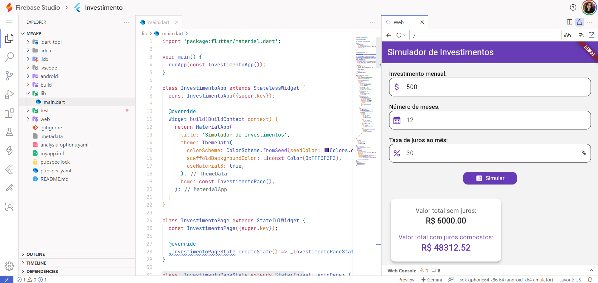

# 💸 Simulador de Investimento – Alternativa ao Financiamento

Este aplicativo foi desenvolvido como atividade da disciplina de Programação Mobile. Ele simula uma alternativa ao financiamento, permitindo ao usuário comparar o valor acumulado com e sem juros compostos ao longo do tempo.

## 🎯 Objetivo

> Mostrar que, ao invés de financiar um bem que não é essencial, é possível **investir mensalmente** e, com paciência, comprá-lo à vista no futuro, economizando dinheiro com juros.

## 📲 Funcionalidades

- Inserir o valor mensal que o usuário pode investir
- Definir o número de meses para o investimento
- Informar a taxa de juros mensal (em %)
- Calcular:
  - ✅ Valor total sem juros
  - 📈 Valor total com juros compostos
- Interface responsiva com visual moderno em **roxo** e **azul claro**

## Formula 
- laço de repetição, exemplo na planilha de Excel nesta pasta testes.xlsx

## Print investimento: 

